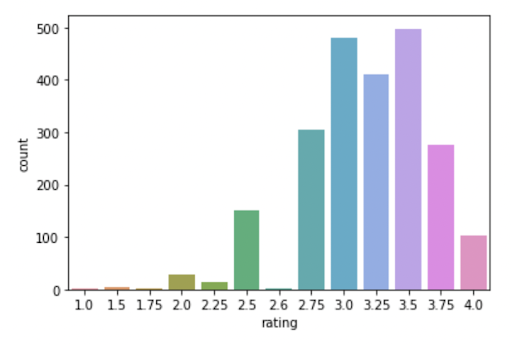
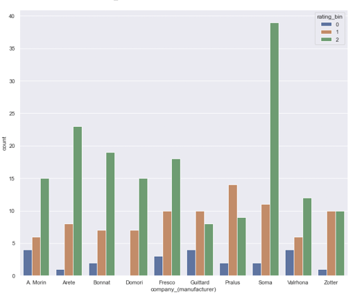
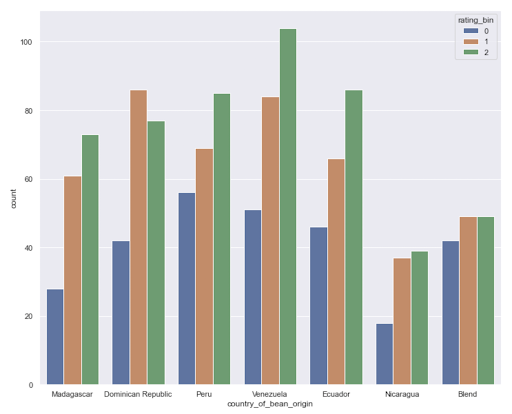
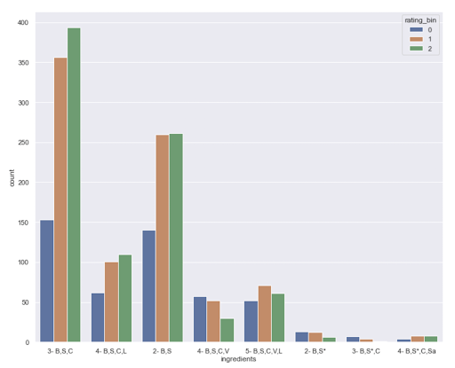
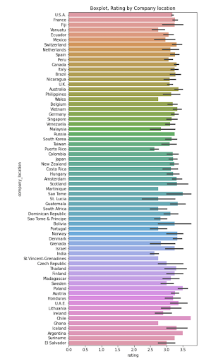
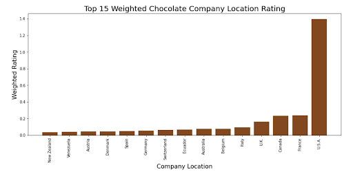
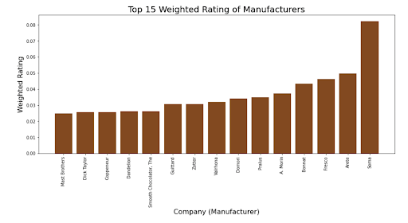
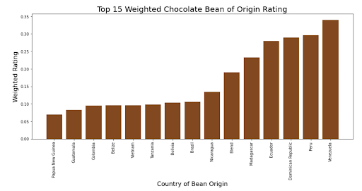
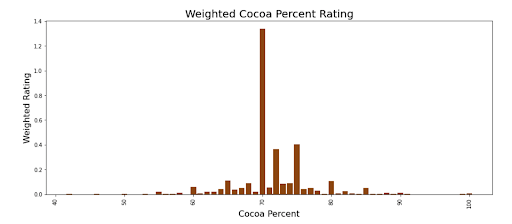

# Dark Chocholate 
---
**Authors**: Jordan Jones, Qiwen Ou, Jordan Johnson
---

## Overview

The focus of this project was to analyze the chocolate bar ratings database and produce a model to predict dark chocolate bar ratings from different features. Our group created a final model looking at multiple different features and parameters.   

---

## Business Problem

The problem our team was faced with was how can we accurately predict ratings for dark chocolate. Our goal was to help a company that wanted to produce dark chocolate to succucfully enter the marketplace 

---

## Data

This dataset contained dark chocolate reviews from 2006-2021. The dataset has ten columns and 2362 rows. The ten columns contain data about company name, cocoa percentage, and ingredients. Our target column in this dataset was rating.

---

## Methods

Our group started out by cleaning and filtering data. Then analyze the different rows and columns in the dataset. Narrow down variables using exploritory data analysis. Use feature engineer to help our model visualize and summarize data. Finally we altered data to get the best model.

---

## Results

In this visual it shows the counts of the rating column. 

---

What manufacturer produces the highest rated chocolate. Also where was the origin of the bean that produced the highest rated chocolate.

 

---

This visualization shows the rating for each ingredient. 

--- 

---

## Conclusions

This model accuracy for predicting dark chocolate ratings is about 80%.

Our recommendations for dark chocolate companies are:

* Use a cocoa bean Venezuela.

* Use 70% cocoa when making chocolate.

* Use Cocoa Bean, Sugar, and Cocoa Butter for the ingredients.

---

## Next Steps

The next steps for this project is to web scrape more data from different sorces to have more rows. Do more feature engineering and try to incorperate more characteristics. 

---

## For More Information

For any additional questions, please contact **Jordan Jones - jtjones1@bsc.edu, Qiwen Ou - qsou@bsc.edu, Jordan Johnson - jrjohnso@bsc.edu**

---